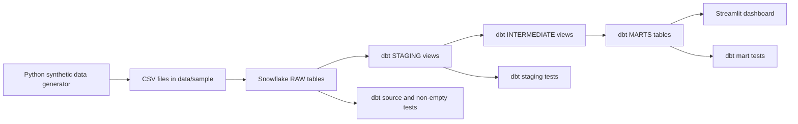

# Architecture

This project follows a simple analytics engineering flow:

```text
Synthetic CSV generator -> Snowflake RAW tables -> dbt STAGING models -> dbt INTERMEDIATE models -> dbt MARTS tables -> Streamlit dashboard
```

## Architecture Diagram



## 1. Synthetic CSV Generator

The project starts with Python code in `data_generator/`. It creates realistic fake retail sales, returns, products, stores, customers, and employees.

As stated in the documentation, the generated data is synthetic and is not meant to represent actual distributions or metrics from real retail data. The synthetic customer and employee data is intentionally non-identifying.

Outputs:

- `data/sample/sales.csv`
- `data/sample/returns.csv`
- `data/sample/products.csv`
- `data/sample/stores.csv`
- `data/sample/customers.csv`
- `data/sample/employees.csv`

## 2. Snowflake RAW Tables

The SQL scripts in `warehouse/` create the Snowflake database, schemas, raw tables, CSV file format, stage example, and load templates. These can be run in Snowflake to create the relevant deliverables.

The RAW layer keeps the generated CSV data close to its original shape. It adds useful load metadata such as `loaded_at` and `source_file`.

## 3. dbt STAGING Models

The staging models in `dbt_retail_returns/models/staging/` clean and standardize each raw table. Staging logic includes:

- Trimming identifiers and text fields
- Normalizing categorical text
- Casting dates, numbers, booleans, and timestamps
- Preserving one row per original record

## 4. dbt INTERMEDIATE Models

The intermediate models in `dbt_retail_returns/models/intermediate/` join and enrich the staging models. These models prepare reusable business logic:

- Enriched sales with product, store, customer, and employee details
- Enriched returns with product, store, customer, employee, and sale date details
- Sales joined to aggregated returns without duplicating sale rows

## 5. dbt MARTS Tables

The marts in `dbt_retail_returns/models/marts/` are final reporting tables. They are designed for business questions and dashboard use. The marts summarize:

- Daily sales and returns
- Product return rates
- Store return rates
- Return reasons
- Policy exceptions
- Employee return activity

## 6. Streamlit Dashboard

The dashboard in `dashboard/app.py` connects to Snowflake with environment variables and queries the `MARTS` schema. It presents these final marts in a business-friendly way using both Streamlit and Plotly libraries.

## Data Quality

The project includes:

- pytest tests for the synthetic data generator
- dbt schema tests for uniqueness, not-null fields, accepted values, and relationships
- dbt singular tests to make sure key raw, staging, and mart tables are not empty

As stated before, this is not production-grade monitoring, but it demonstrates the core quality checks expected in a small analytics engineering project.

